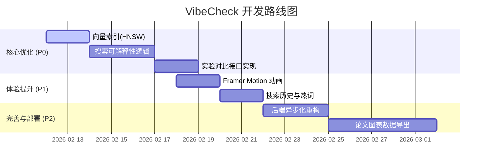

# VibeCheck 策略性优化与系统性建议 (升级版)

> **文档说明**：本建议基于对项目全栈代码（FastAPI + React）及 5.3w+ 数据规模的深度调研，结合毕设评分重点（性能、创新、可解释性）制定的详细优化方案。

---

## 1. 核心检索与后端优化 (P0 - 必做)

### 1.1 向量索引加速 (HNSW)
目前数据库规模已达 5.3w+，直接使用 `<=>` 会触发全表扫描。**必须建立索引**，演示时的流畅度是评分关键。
*   **建议**：在 `songs` 表上为 `review_vector` 和 `lyrics_vector` 建立 **HNSW** 索引。
*   **SQL 参考**：
    ```sql
    -- HNSW 索引（pgvector 0.5+ 推荐，精度更高）
    CREATE INDEX idx_review_vector_hnsw ON songs
      USING hnsw (review_vector vector_cosine_ops) WITH (m = 16, ef_construction = 64);

    CREATE INDEX idx_lyrics_vector_hnsw ON songs
      USING hnsw (lyrics_vector vector_cosine_ops) WITH (m = 16, ef_construction = 64);
    ```

### 1.2 搜索可解释性 ("为什么推荐这首歌")
这是 PRD 中的亮点。在搜索结果中增加理由反馈，显著增强论文的“算法可解释性”论点。
*   **建议**：后端在 SQL 中返回 `review_score`、`lyrics_score`、`rational_score`，前端动态生成文案。
*   **例子**：`"评语语义匹配 82% · 歌词关键词命中「孤独」「深夜」"`

### 1.3 对比实验数据接口
为论文中的对比实验 (RQ1~RQ3) 提供支持。
*   **建议**：新增 `/api/experiment/compare` 接口，支持通过参数切换模式：
    - `mode=tfidf`: 仅使用理性特征。
    - `mode=vector`: 仅使用感性特征。
    - `mode=hybrid`: 当前混合模式。

### 1.4 后端异步化与流式代理
*   **异步化**：`embedding.py` 应从 `requests` 迁移至 `httpx.AsyncClient` 以避免阻塞 FastAPI 事件循环。
*   **流式改进**：`songs.py` 的音频代理建议使用 `resp.aiter_bytes()` 真正流式转发，而非一次性读取整个内容，优化大文件内存占用。

---

## 2. 前端体验与交互 (P1 - 提升)

### 2.1 交互动画 (Framer Motion)
目前的页面切换较为生硬。
*   **建议**：引入 `framer-motion`。
    - 使用 `AnimatePresence` 包装路由切换。
    - 为 `SongCard` 增加 stagger 入场动画（利用已有 `.stagger-children` 类名）。

### 2.2 搜索历史与热词
*   **建议**：在搜索框下方增加：
    - **最近搜索**（localStorage 存储）。
    - **热门意境**（从 `vibe_tags` 统计高频热词并展示为 pill）。

### 2.3 播放器与进度优化
*   **建议**：在 `CompactPlayer` 中增加**预加载 (Preload)** 逻辑。用户悬停 `SongCard` 时通过 Prefetch 提前请求音频代理。

---

## 3. 功能链条完善 (P2 - 创新)

### 3.1 意图路由精准化
*   **优化**：在 LLM Prompt 中增加对“否定词”的支持（如“不要太伤感的歌”），动态降低对应维度的权重。

### 3.2 用户收藏与灵魂画像 (Soul Persona)
*   **建议**：基于用户收藏或点击 Top 20 歌曲的向量平均值 (Mean Pooling)，利用 LLM 生成一段个性化的“审美侧写”。

---

## 4. 工程化与代码体检

### 4.1 代码小问题列表 (待修正)

| 位置 | 问题 | 建议 |
| :--- | :--- | :--- |
| `recommend.py` | 公式注释含 TF-IDF 但实际代码未计算 | 补上 TF-IDF overlap 或修正注释。 |
| `search.py` | `0.4` 阈值硬编码 | 提取至环境变量或 `config.py`。 |
| `SearchPage.jsx` | 在渲染逻辑中使用 `useState` 处理副作用 | 应遵循 React 19 规范使用 `useEffect`。 |
| `llm.py` | 缺乏 LLM 降级处理 | 增加对 API 失败的 Catch，降级为纯全文检索。 |

---

## 5. 建议开发优先级路线图



---
*Updated by GitHub Copilot @ 2026-02-11*
